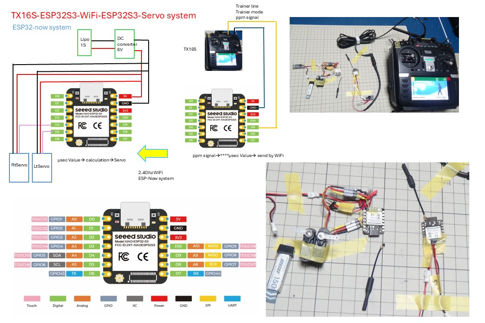

# 2ServoFlapOrnithopter-by-ESPnow-WiFi-on-ESP32S3

　*** Caution!! ***

　　　　This system is an experimental design.

　　　　It has not yet been used in actual flights.

　　　　For actual flights, it is safer to use a standard transmission system.
  *********

　 Running 2ServoFlapOrnithopter system using Wi-Fi (ESP-Now system) on Seeed Studio XIAO ESP32S3

The Seeed Studio ESP32S3 is a high-speed board operating at up to 240MHz and features 2.4GHz Wi-Fi capabilities.

By connecting two ESP32S3s using the ESP32-now system, the receiver can be omitted, thus reducing the weight of the Ornithopter.

Code was created while interacting with the AI. Since the existing PMMReader cannot be used with the ESP32S3, this was created first, followed by code using the ESP-now system.

The radio waves seem to reach about 50-100 meters, so it might be usable with a small Ornithopter. 

Please refer to the following link for the mechanism of 2ServoFlapOrnithopter:

https://github.com/KazuKaku/2ServoFlapOrnithopter

1. First, write the CODE (ESP32S3WiFiSFOfor2SFOV3RXCODE.ino) to the receiving ESP32S3 and display the Serial monitor.
Confirm the MAC address.
Display on the receiving serial monitor:
"EX. : RX
ESP-NOW RX minimal
RX My MAC: 1C:DB:D4:75:64:C8"

2. Next, write the receiver's MAC address to the CODE of the transmitting ESP32S3.

Write the MAC address of the RX-side ESP32 (be sure to match it to the RX's MAC address) to the transmitting side's CODE (ESP32S3WiFiSFOfor2or4SFOV3TXCODE.ino).

"EX. : uint8_t peerMac[] = {0x1C, 0xDB, 0xD4, 0x75, 0x64, 0xC8};"

TX16S-ESP32S3-WiFi-ESP32S3-Servo system for 2Servo Flap Ornithopter
(https://www.youtube.com/watch?v=kpqIa_A7cuo)
